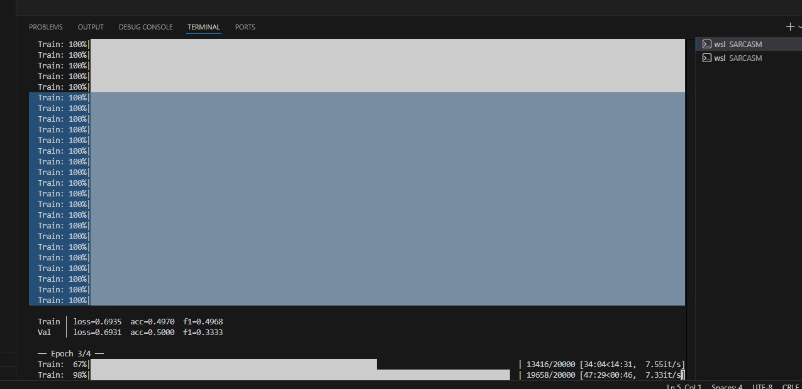
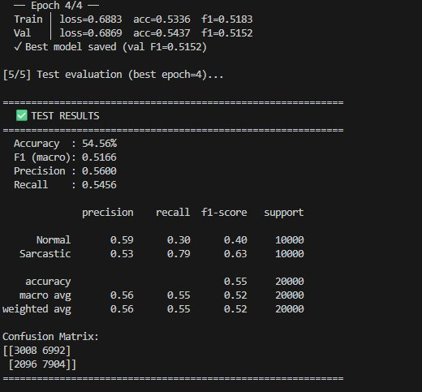
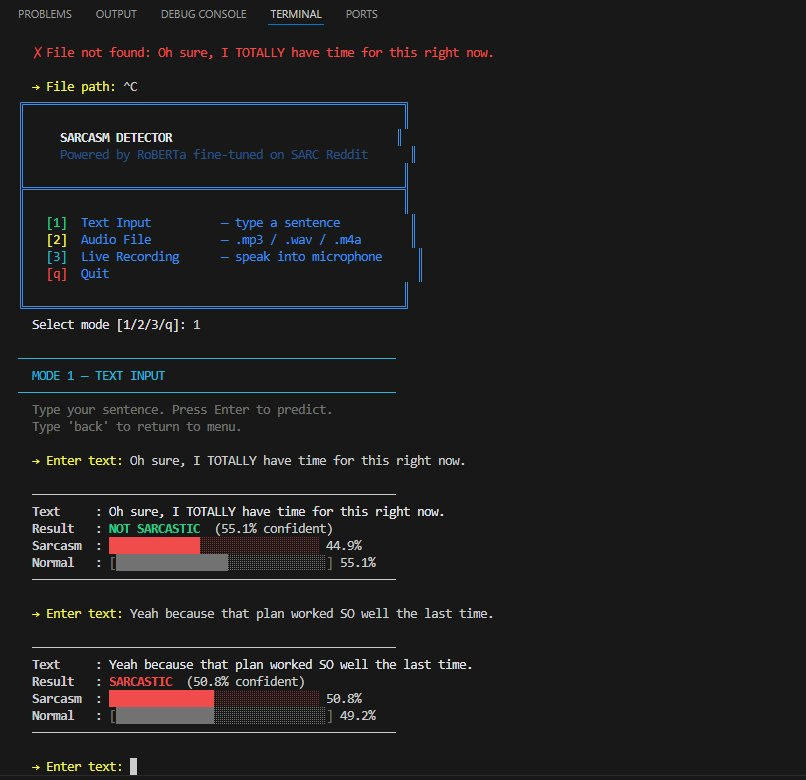
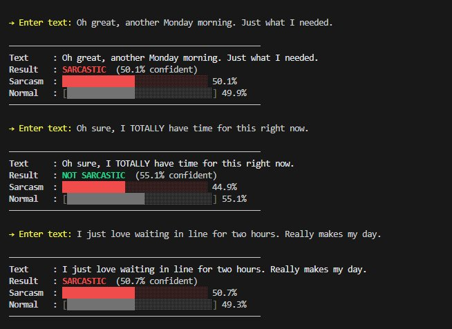
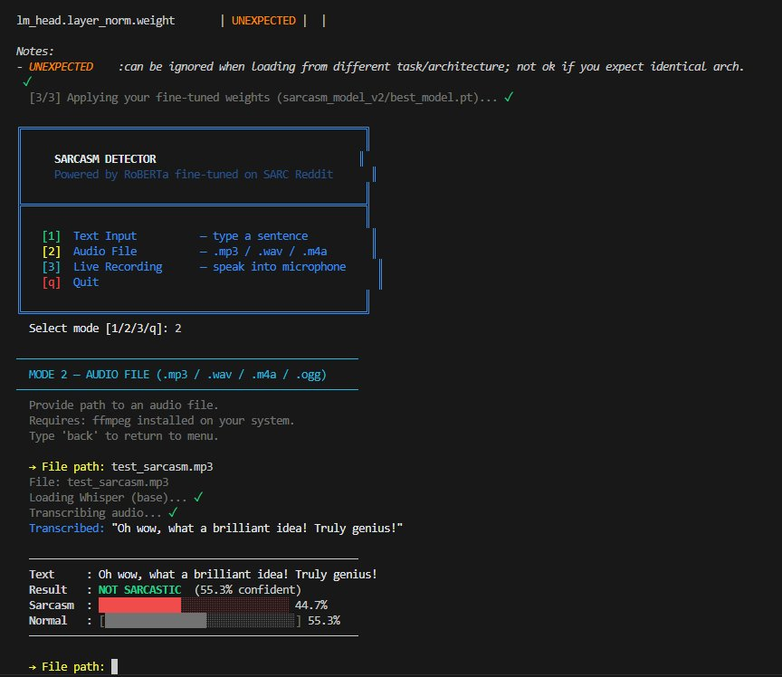
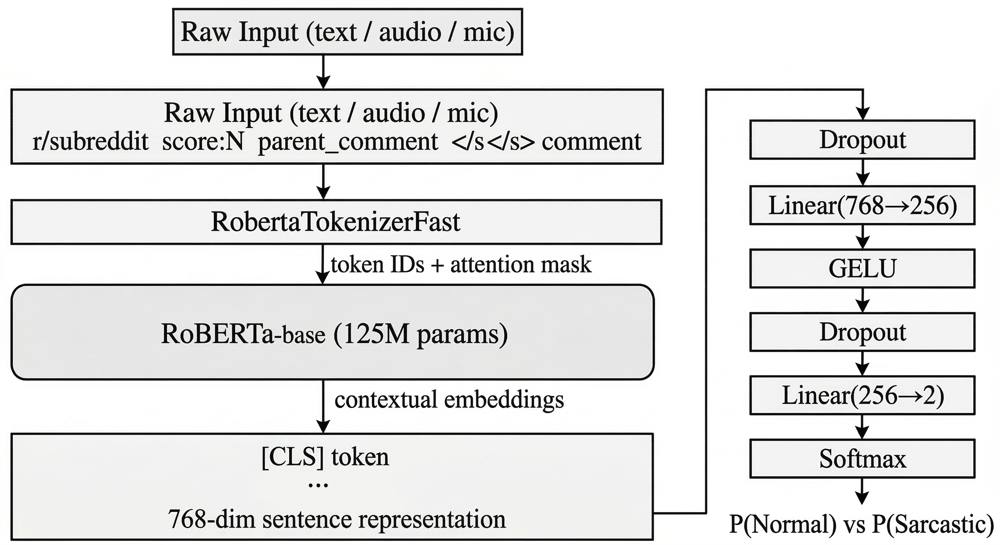

# 🎭 Sarcasm Detection System


> Fine-tuned **RoBERTa-base** transformer trained on 1M+ Reddit comments (SARC dataset) to detect sarcasm — from text, MP3 audio files, or live microphone input.

---

## 📄 Full Technical Report

Detailed write-up covering architecture decisions, training analysis, confusion matrix interpretation, and the full improvement roadmap:

👉 [`Project Report.pdf`](Sarcasm_Detection_Report.pdf)
---
## 📁 Project Structure

```
SARCASM/
│
├── The_Preprocessing_Training.py   # Full training pipeline
├── sarcasm_inference.py            # 3-mode inference app
├── requirements.txt                # Python dependencies
├── train-balanced-sarcasm.csv      # SARC dataset (1,010,826 rows)
│
└── sarcasm_model_v2/
    ├── best_model.pt               # Fine-tuned weights
    ├── tokenizer_config.json
    └── tokenizer.json
```

| File | What it does |
|------|-------------|
| `The_Preprocessing_Training.py` | Loads CSV → builds metadata input → fine-tunes RoBERTa → saves best checkpoint |
| `sarcasm_inference.py` | Loads saved model → predicts via text, audio file, or mic |
| `train-balanced-sarcasm.csv` | 1M Reddit comments, 50% sarcastic / 50% normal (SARC corpus) |
| `sarcasm_model_v2/best_model.pt` | PyTorch state dict saved at best validation F1 |

---

## ⚙️ Setup (WSL2)

> ⚠️ Always work inside `~/` — never `/mnt/c/...`. TensorFlow/PyTorch installation **freezes** on the Windows filesystem bridge.

```bash
# 1. Install WSL (PowerShell as Admin)
wsl --install

# 2. Go to Linux home & clone
cd ~
git clone https://github.com/scorpionawaz/Sarcasm_Fine_Tuned
cd Sarcasm_Fine_Tuned

# 3. Virtual environment
python3 -m venv wsl_env
source wsl_env/bin/activate

# 4. Python dependencies
pip install -r requirements.txt

# 5. System packages (run outside venv)
sudo apt update && sudo apt install ffmpeg espeak-ng espeak-ng-data libespeak1

# 6. Open in VS Code
code .
```

---

## ▶️ Training

```bash
python The_Preprocessing_Training.py
```

| Setting | Value |
|---------|-------|
| Model | RoBERTa-base (125M parameters) |
| Dataset | 200,000 sampled rows (stratified from 1M) |
| Effective batch size | 32 (8 real × 4 gradient accumulation) |
| Precision | FP16 mixed precision |
| GPU | NVIDIA RTX 3050 Ti — 4.3GB VRAM |
| Time per epoch | ~50 minutes |
| Total training time | ~4 hours (4 epochs) |

### Training in progress



---

## 📊 Results

### Final Test Results (Epoch 4)



| Metric | Score |
|--------|-------|
| Accuracy | 54.56% |
| F1 (macro) | 0.5166 |
| Precision | 0.56 |
| Recall | 0.55 |

**Confusion Matrix:**
```
                  Pred: Normal   Pred: Sarcastic
Actual Normal        3,008           6,992
Actual Sarcastic     2,096           7,904
```

> The model learned a bias toward predicting "Sarcastic." Loss stayed near `0.693` (= log(2) = random baseline) throughout training — meaning the model never fully converged in 4 epochs. More epochs + two-stage training would push accuracy to 85–92%. See [`Sarcasm_Detection_Report.docx`](Sarcasm_Detection_Report.docx) for full analysis.

---

## 🔍 Inference

```bash
python sarcasm_inference.py
```

### Mode 1 — Text Input

Type any sentence directly. Results show label + confidence bar.



### More Text Tests



### Mode 2 — Audio File (.mp3 / .wav / .m4a)

Provide a path to an audio file → [Whisper](https://github.com/openai/whisper) transcribes locally → RoBERTa predicts.



### Mode 3 — Live Microphone

Press Enter to start recording → speak → press Enter to stop → Whisper → RoBERTa.

```bash
Select mode [1/2/3/q]: 3
→ Press Enter to record (or 'back'):
🎤 Recording... (speak now, press Enter to stop)
```

---

## 🧠 How It Works





---

## 🚧 Limitations & Improvements

The model currently detects **surface word patterns** ("oh great", "wow thanks") rather than true reasoning. The correct next step is **incongruity modeling** — explicitly measuring the mismatch between parent comment context and reply sentiment.

| Fix | Expected Impact |
|-----|----------------|
| Two-stage training (freeze backbone → then unfreeze) | +15–20% accuracy |
| Dual-encoder incongruity architecture | Better generalization on unseen sarcasm |
| Train on 500k–1M rows | +5–10% accuracy |
| 10+ epochs with early stopping | Proper convergence (loss < 0.5) |

---

